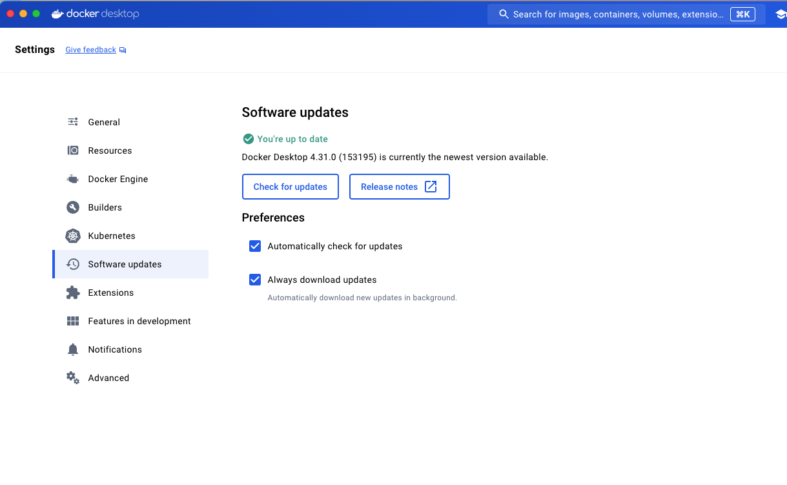

## Introduction
This repo shows how to secure credentials (Database, api key etc) using Docker Secrets.

The premise is Camunda 7.22 installation using Docker.


## Configuration Files
Two yml configuration files are present in the Camunda core setup.

`default.yml and production.yml`


We will introduce database properties via defined secret variables.

```
spring.datasource:
  url: ${SECRET_ML_DB_URL}
  driver-class-name: ${SECRET_ML_DB_DRIVER}
  username: ${SECRET_ML_DB_USERNAME}
  password: ${SECRET_ML_DB_PASSWORD}
```

## Pre-requisites

Docker Desktop app is running with this or latest version.



Run the below commands to download Camunda base image for 7.22 and also initialise Docker Swarm.

```
$ docker pull briarm/camunda:camundaRum_7.22_v1.0
$ docker swarm init 
```


## Secret variables
Let's create necessary secret variables via Docker.

The parameter '-' indicates that you are going to enter the value (via keyboard) and press *Ctrl + d*.


$ `docker secret create SECRET_ML_DB_URL -`

jdbc:h2:mem:camunda-makelabs-in;DB_CLOSE_DELAY=1000

Press Ctrl D to save and complete creating secret

$ `docker secret create SECRET_ML_DB_DRIVER -`

org.h2.Driver

Press Ctrl D to save and complete creating secret

$ `docker secret create SECRET_ML_DB_USERNAME -`

sa

Press Ctrl D to save and complete creating secret

$ `docker secret create SECRET_ML_DB_PASSWORD -`

sa

Press Ctrl D to save and complete creating secret

To list the secrets, use this command.

$ `docker secret list`


## New Docker image
Let's create a *new* image using the Camunda base image. 
See Dockerfile for more info.

$ `docker buildx build -t camunda7-22 .`


## Runtime container with Secrets
Create and Run docker service using the new image created in the last step.

This service has access to the two secret variables.

Name of the docker runtime container is **camunda7-22-runtime**.

$ `docker service  create --name camunda7-22-runtime  --restart-max-attempts 1 --replicas 1 --secret SECRET_ML_DB_URL --secret SECRET_ML_DB_DRIVER --secret SECRET_ML_DB_USERNAME --secret SECRET_ML_DB_PASSWORD "camunda7-22"`


## Clean up
If you are running this project as a PoC, you may want to remove the docker service. Use below command.

This completes the clean up of runtime container.

```
$ docker service rm camunda7-22-runtime
```

--------------------
## Other notes

Docker secrets are stored in encrypted form.

https://docs.docker.com/engine/swarm/secrets/